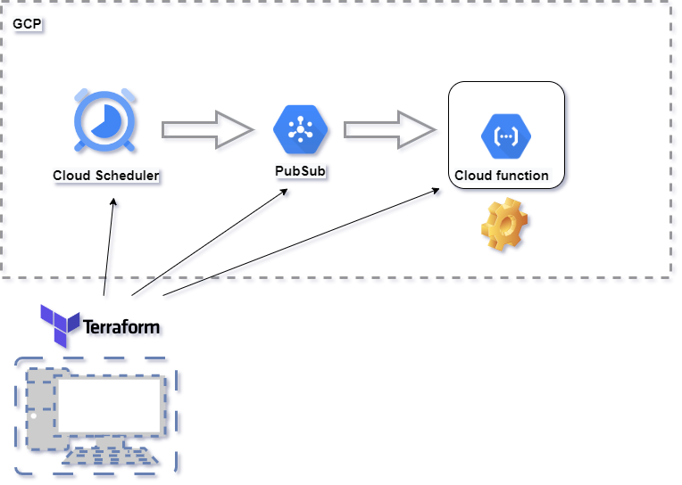
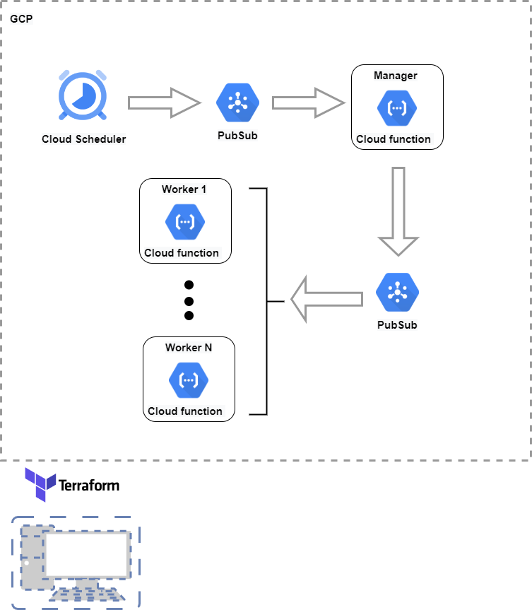
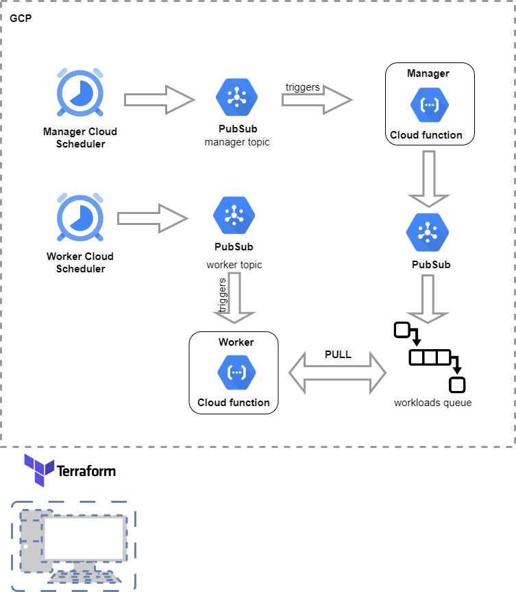

# serverless-scalability

### labels:
#### terraform, cloud-functions, gcp, pubsub

##To deploy, run below commands (in terraform folder):
```
terraform init
```
```
terraform plan
```
```
terraform apply
```

There is a branch for each of the three scenarios. Scenario 2 includes scenario 1 and scenario 3 includes scenario 2 and scenario 1.

## Scenario 1
####Diagram:



The simplest scenario is when you have to perform tasks (periodically or as a consequence of an event).
For this use case, a cloud scheduler component that writes data to a PubSub topic, and a cloud function that is subscribed (automatically to that topic) will perform the given task and then close.

Cloud infrastructure is controlled by a terraform script (with state stored on cloud storage). 

Due to limitations in the maximum run time of a cloud function (9 mins) some processing jobs cannot be fulfilled and have to be split in multiple jobs (cloud function runs). Enter scenario 2.

## Scenario 2
#### Diagram: 



When workloads are more complex or time consuming, we can have a cloud function playing the "manager role", adding workloads on a different PUBSUB topics that will trigger automatically worker cloud functions for execution.

This works very well especially when the workloads can be processed in parallel. 

However, when the tasks have to be processed sequentially, this architecture can get us into troubles, as we will be forced to keep a limited number of worker instances running at the same time (1 instance usually) but the workload queues will try to trigger worker cloud functions continuously, failing to do so.

In such a case, we need a more complex scenario. Here comes scenario 3.

## Scenario 3
#### Diagram: 



Scenario 3 contains an even more flexible solution. The worker has its own independent scheduler, so manager that creates workloads and the workers are totally independent.

The Worker is no longer triggered by the creation of the workloads, but by the scheduler. Whenever it is invoked, it will PULL workloads from the workload queue. This allows us to configure how many workloads can be pulled for each invocation depending on the execution time, allowing us to optimize for speed and cost.


## Conclusions

Using serverless architecture and terraform for cloud state management greatly reduces devOps and sysEng tasks, allowing even novice developers to be proficient in setting up infrastructure quickly. Reliability and scalability are attributes guaranteed out of the box by the cloud provider, which lets the developer focus on the business case. The ways of thinking in serverless design are quite different from standard micro-services or monolith approaches, but very quick to grasp. However, limitations and cost targets must be taken into account at each step, so Cloud computing knowledge is required.  